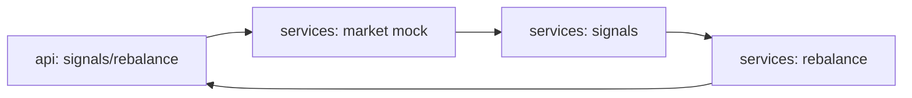

# agent-stock-portfolio

[](https://github.com/Shamanchi/agent-stock-portfolio/actions/workflows/ci.yml)
[](https://www.python.org/)
[](./Dockerfile)
[](./LICENSE)

> **English TL;DR:** FastAPI stock-portfolio analyst: SMA-crossover trend signals and dividend yields from mock histories plus a rebalance plan toward target weights. Fully offline, no tokens needed.

Агент анализа stock-портфеля: тренд-сигналы по пересечению SMA и дивидендная доходность из mock-историй плюс план ребалансировки к целевым весам. Работает офлайн.

Источник темы: `Hands-On-AI-Engineering / P-143 (stock_portfolio_analyst)` — идею и постановку взяли из каталога, код и тексты написаны с нуля.

## Какую задачу решает

Нужно понять состояние позиций и что перебалансировать: агент считает SMA-сигналы по каждой бумаге, показывает доходность и строит план сделок к целевым долям.

## Архитектура



Слои: `api/` → `services/` → `core/`, настройки через `pydantic-settings`.

## Быстрый старт

```bash
cp .env.example .env
pip install -r requirements.txt
uvicorn app.main:app --reload
curl -X POST http://127.0.0.1:8000/api/v1/signals -H "Content-Type: application/json" -d "{\"tickers\": [\"AAA\", \"BBB\"]}"
```

Docker:

```bash
docker compose up --build
```

## API

- `GET /api/v1/health` — проверка сервиса.
- `GET /api/v1/universe` — тикеры mock-вселенной.
- `POST /api/v1/signals` — сигналы. Тело: `{"tickers": ["AAA", "BBB"]}`. Ответ: `sma_short`, `sma_long`, `signal` (bullish/bearish/neutral), `yield_pct`.
- `POST /api/v1/rebalance` — план сделок. Тело: `{"holdings": [{"ticker": "AAA", "value": 600}], "targets": {"AAA": 0.5, "BBB": 0.5}, "price": {"AAA": 100, "BBB": 100}}`.

Пример ответа `signals` (сокращённо):

```json
{
  "signals": [{"ticker": "AAA", "sma_short": 23.0, "sma_long": 17.6, "signal": "bullish", "yield_pct": 1.5}]
}
```

## Переменные окружения (.env)

| Переменная | Назначение | По умолчанию |
|---|---|---|
| `SMA_SHORT` | Окно короткой средней | `5` |
| `SMA_LONG` | Окно длинной средней | `20` |
| `APP_HOST` / `APP_PORT` | Хост/порт API | `0.0.0.0` / `8000` |

Полный список — в [.env.example](./.env.example).

## Тесты

```bash
pip install -r requirements.txt
pytest -q
pytest -q -m integration
```

Unit-тесты без сети. Интеграционные (`-m integration`) — через TestClient, тоже без сети.

## Контакты

- Telegram: @PavelYrevichh
- Email: Lietman46@mail.ru
- GitHub: Shamanchi
- FL.ru: https://www.fl.ru/users/Shamanchi
